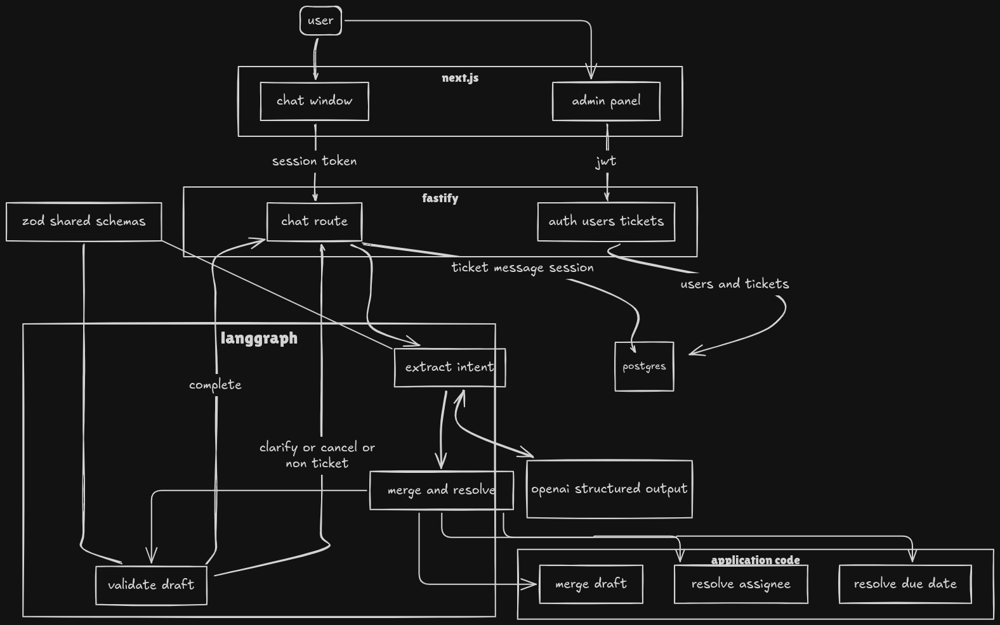

# Tixly — AI-powered chat-to-ticket management

Natural-language chat becomes structured, trackable tickets. An LLM extracts mentions application code resolves assignees/dates, validates required fields, and owns ticket creation.

## Problem / approach

Teams report issues in chat (“Login is broken on Safari, Rahul will fix it by the 4th”). Tixly turns that into a ticket or asks one short follow-up when assignee/date are missing or ambiguous.

**Architecture principle:** the model interprets language and returns structured mentions plus conversational reply wording. Entity resolution, validation, authorization, and DB writes stay in application code. The confirmation card is built only from the saved ticket row.



## Tech stack

| Layer | Choice |
|-------|--------|
| Frontend | Next.js 15, TypeScript, Tailwind |
| Backend | Fastify 5, TypeScript strict |
| AI orchestration | LangGraph.js |
| LLM | OpenAI Responses API + Structured Outputs via `LLMProvider` |
| Validation | Zod (`@tixly/shared`) |
| Dates | English-normalized mentions → chrono-node (`forwardDate`) |
| DB | PostgreSQL + Prisma 7 (`@prisma/adapter-pg`) |
| Auth | JWT Bearer (admin); public chat with session token |

## Prerequisites

- Node.js 20.9+
- pnpm 10+
- Docker (for local Postgres) or any PostgreSQL 16+
- OpenAI API key with access to `gpt-5.6-luna` (or set `OPENAI_MODEL`)

## Setup

```bash
# from repo root
cp .env.example apps/api/.env
# edit apps/api/.env — set OPENAI_API_KEY, JWT_SECRET, and DATABASE_URL

cp apps/web/.env.local.example apps/web/.env.local 2>/dev/null || true
# ensure apps/web/.env.local has NEXT_PUBLIC_API_URL=http://localhost:3001

# option a: use Docker Postgres on host port 5434
docker compose up -d

# option b: point DATABASE_URL at any existing Postgres 16+ database named tixly

pnpm install
pnpm --filter @tixly/shared build
pnpm --filter @tixly/api db:generate
pnpm --filter @tixly/api exec prisma migrate deploy
pnpm db:seed
```

### Run

```bash
# run from repo root
pnpm dev:api   # http://localhost:3001
pnpm dev:web   # http://localhost:3000
```

### Tests

```bash
pnpm test
```

## Environment variables

See [`.env.example`](.env.example).

| Variable | Where | Purpose |
|----------|--------|---------|
| `DATABASE_URL` | API | Postgres connection |
| `OPENAI_API_KEY` | API | OpenAI secret (never exposed to the browser) |
| `OPENAI_MODEL` | API | Default `gpt-5.6-luna` |
| `JWT_SECRET` | API | Admin JWT signing |
| `CORS_ORIGIN` | API | Allowed web origin(s), comma-separated |
| `NEXT_PUBLIC_API_URL` | Web | API base URL |

## Demo credentials

| Item | Value |
|------|--------|
| Admin email | `admin@tixly.demo` |
| Admin password | `DemoAdmin123!` |
| Seeded assignees | Priya, Amit, Rahul Sharma (Backend), Rahul Verma (Frontend) |
| Chat | Public use **New Chat** between acceptance scenarios |

## Important implementation decisions

1. **llmprovider interface** like openai can be swapped later. langgraph only talks to the provider interface.
2. **extraction and wording are separate.** one structured call extracts the ticket fields. if clarification is needed, a second call writes the question in the user's language using the date and assignee already resolved by the app. this reply is never used for ids, status, assignee, or date. if the wording call fails, the extraction reply is used as-is.
3. **day-without-month policy** if the user gives only a day, tixly proposes the next possible date and asks for confirmation before creating the ticket. the brief's example c allows auto-creation for `"4 tarikh tak"`, but this can mean different dates, so tixly chooses confirmation instead.
4. **chat session security** each chat uses a uuid session id and an `x-session-token`. only the token hash is stored. invalid or missing tokens return 404. new chat clears the current session from the browser.
5. **relative dates** use the browser's local iana timezone. this timezone is sent with every message, with utc as the fallback.
6. **ticket ordering** tickets are fetched newest first using createdat desc.
7. **creation source** defaults to chat and is shown on the ticket detail page.

## Known limitations

- chrono works on the english-normalized date phrase. less common languages and date formats depend on the llm's `duedatementionen`.
- streaming, slack/whatsapp integrations, and duplicate ticket detection are not done right now.

